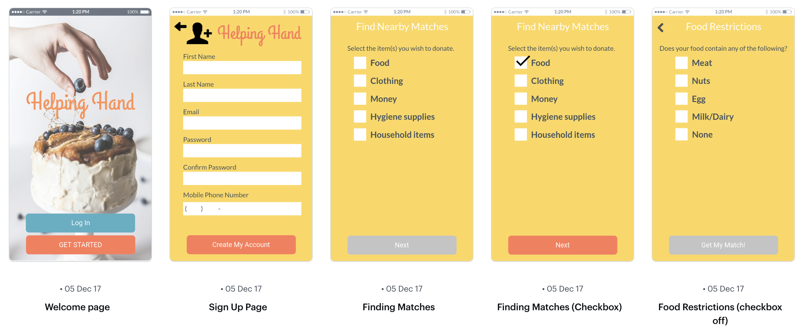
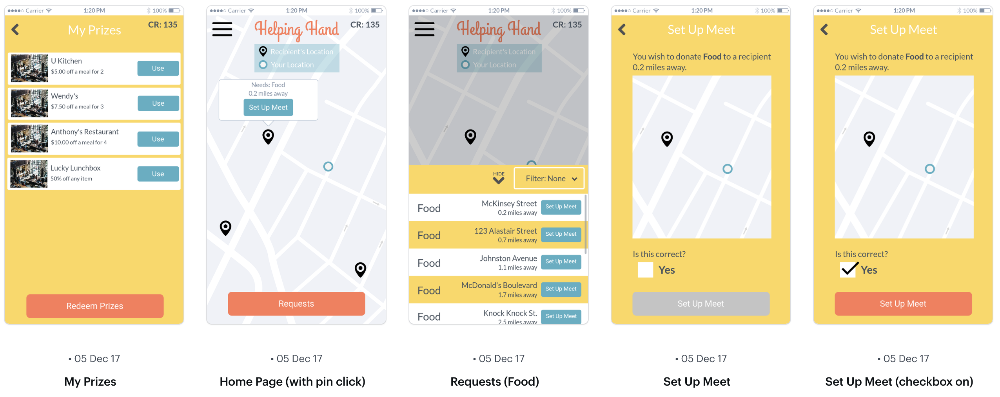
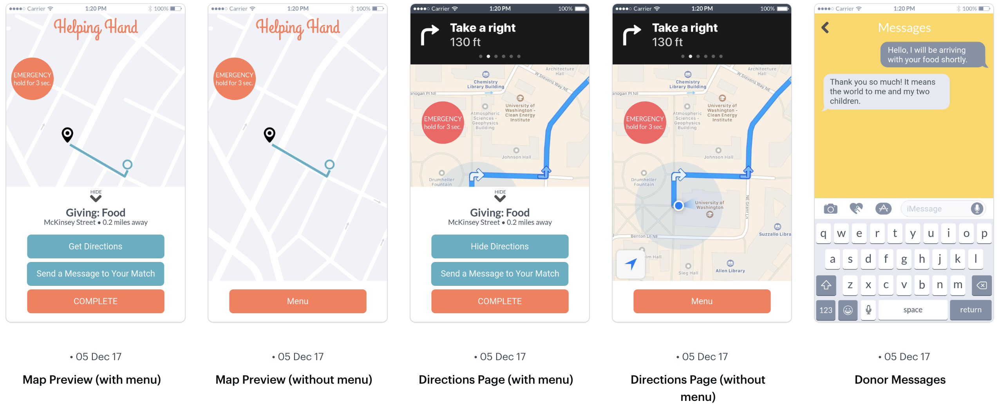

# Helping Hand
Author: Gagandeep Thind

Poverty is one of Americas biggest, most relevant issues today. According to the United States Census Bureau, the poverty rate was 12.7% in 2016. While many are living without even the necessities of life like food and shelter, others have tremendous resources readily accessible. On top of this 57,000 college students are estimated to be homeless across the country according to a survey on the financial aid. We can sharply reduce this gap through targeting college students and trying to get them to donate their extra resources such as food and blankets. Why not share this abundance of wealth available to certain people, especially when the privileged no longer need it?

Our team will be investigating how to safely, efficiently, and responsibly distribute unwanted but perfectly sound food and supplies from common people to those in poverty, primarily the homeless, through technology. The primary reason why people give and help others is for their own self satisfaction, or for the feeling they get when they put a smile on another persons face. We want to emulate that feeling while breaking barriers within our local communities between the homeless and those who are privileged enough to help by creating a direct connection between these two parties. Ensuring that those who have a deficit get what they need is gratifying first because giving to another human leaves a lifelong impression on both parties along with knowing the clothes and supplies end up with people who genuinely need them. Another common problem is food waste. It is estimated that food waste accounts for 30-40% of the food supply in America (United States Department of Agriculture). People have food that they want to give, but they do not have a way to give so they throw it away. Creating a system to aid the needy would not only feed the hungry, less food would go to waste and more money would be saved nationally.

Currently, when people want to give clothes and household items away, they usually donate them to organizations such as Goodwill or the Salvation Army. While it is convenient for those donating the items, it can be problematic for those in poverty who need those goods: They have to go to a store, which may not be conveniently accessible, and also have the money to purchase the goods. While the organization profits, the ones who are truly in need do not. Regarding food, people tend to donate to local food banks and drives. Although people can get food at food banks for free, they may not be able to go during the shopping hours because they are working or they do not have the resources or transportation to get to a food bank. Additionally, many food banks and drives encourage the donation of canned goods, which are neither nutritious nor filling. While it does provide some food, it is not enough for a family meal. Getting food from the food bank requires a certain amount of planning. If someone who relies on the food bank for food misses the shopping hours, they would have to find another way to get food for a prolonged period of time with low resources available. Even if someone gets food from the food bank, it may not last them for however long they need. Creating a system that provides those in poverty with food, clothing, and other supplies on a day-to-day basis will reduce the need to find these resources while repurposing what others wish to give.

### The Approach

Helping Hand is a mobile application that will attempt to tackle the problem of poverty and food wastage by connecting college students or just people with extra resources to nearby homeless people. This app will be an interface which will allow users to tell what resources they have to give such as food or clothes or anything that will be of help. The receivers, or homeless people, who generally don't have smartphones, will have to just text a number which we have configured using a cloud communications platform such as Twilio that we will use to create programmable SMS. This programmable SMS will ask the receiver of their current location and what they are looking for. The mobile application for the smartphone giver will be asked to share their location and what they want to give. We will then use geolocation with Google Maps API to match the two closest giver and receiver so that the giver can go over and directly give whatever they have. We use this approach of face to face transaction because we feel that there is no other feeling than personally putting a smile on someones face rather than donating through a third party such as Goodwill. By doing this, we will also help break down barriers between our local communities and see that homeless people are quite approachable and not scary as we may perceive them to be. In order to enhance this communication, we have also a messaging service where the giver can send messages to the homeless receiver in order to plan where to meet up or send any other kind of information/directions. We also realize the safety and privacy is a very important issue during this giving process and so all messages will be hosted through our web hosting Firebase, in order maintain full anonymity of both parties. If any safety concerns were to flag up, we also have included a contact police button which will dial 911 immediately to get support and send the user's location to them. This button has to be pressed for at least 3 consecutive seconds which will grow larger as it is held down until it starts blaring in order to avoid accidental presses. Once the transaction is completed, the receiver will be prompted with a text asking so, and they will respond with "Y" or "N". If "Y" is pressed, then the user will immediately get credit in our app which will allow them to claim prizes such as coupons to nearby restaurants, which will serve as an incentive to give and an encouragement to restart the cycle of eating food and giving away any leftover food.

### High Fidelity Prototype

### Usage Scenarios

Diana Reeves is a college student who wants to help out people in need. She will be participating in our service, Helping Hand, as a donor. Suppose that she had just eaten lunch, but could not finish all of her food. In order to set up her account to start donating, she will click on the "get started" button. This button will take her to a screen that will prompt her for a username, email, password, phone number, and zip code so she can create an account. After she creates an account, she will be taken to the home page. Here, she will see a map with pins showing the locations of people with requests, a side menu, and a requests button. She will click on the requests button which will introduce a slide up menu with all of the requests from people in need of food, clothing, and more ordered from nearest to farthest away from her. In order to begin fulfilling a request, she will click on the "set-up meet" button on the request she would like to fulfill. Additionally, Diana can also tap on a pin on the map to see what that person needs and how far away they are as well as set up a meet. This button will take her to a messages page where she can begin a conversation with the donee if the donee accepts the donation. Through messaging, she will set up a meeting with the donee in order to make the exchange. Once the exchange is completed, she will click a button to end the process. If the donee acknowledges that he or she has received the item(s), Diana will automatically be disconnected from the donee so neither can contact each other again. She will also get points in the app for her act of kindness which she can use to redeem prizes such as coupons. She will then click on the side menu which contains a settings button, a redeem prizes button, a view prizes button, and a log out button. In order to get prizes for her points, she will click on the redeem prizes button. There, she can choose which coupon she wants and click redeem to add it to her prizes. Suppose she chooses a Wendy's coupon for $5.00 off a meal for 2. This coupon costs 1000 points, so 1000 points will be subtracted from her total points. The next time she goes to Wendy's she can click on the "view prizes" button in the side menu to see all of the prizes she has gotten. She will select the Wendy's coupon by clicking on the "view" button. This will give her a coupon code that the cashier at Wendy's can use to give her a discount. After she has used this coupon, it will get deleted from her prizes.

Dorothy Cantrell is a homeless mother who will be receiving donations through our service. She texts a code to a specific number to join our service since she does not have a smartphone and cannot access the app. When she wants to request items (clothing, food, etc.), she sends a message to the same number to make her request. This request shows up in our donors apps along with her location. If a donor chooses to fulfill her request, she will receive a text informing her of the item being donated. It will prompt her to respond with "Y" or "N" to either accept or reject the donation. If she accepts the donation by responding with "Y", she will receive a second text instructing her to continue texting to set up a meeting with the donor. When the donor informs our service that the donation has been made successfully, she will receive a text asking her to confirm this statement. She can respond "Y" or "N" indicating whether or not she has received the donation. She will then be automatically disconnected from the donor and be unable to contact them in the future.
